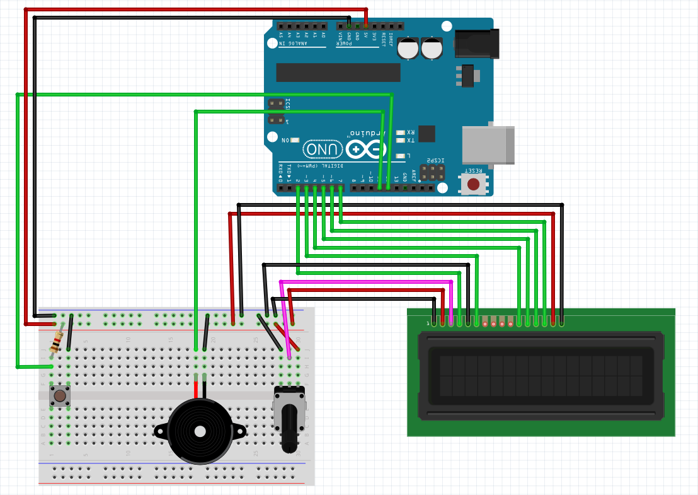

# Arduino Pomodoro Countdown Timer with LCD Display
Need to improve your work flow? Great! maybe this one's for you.

## What's it do?
This arduino project acts as a countdown timer for 25 minute durations, after which a brief alarm will sound. You can see the time counted down on a 16 x 2 LCD Display, the timer can be paused with the press of a tactile push button and reset by pressing the little reset button located on the arduino board.

