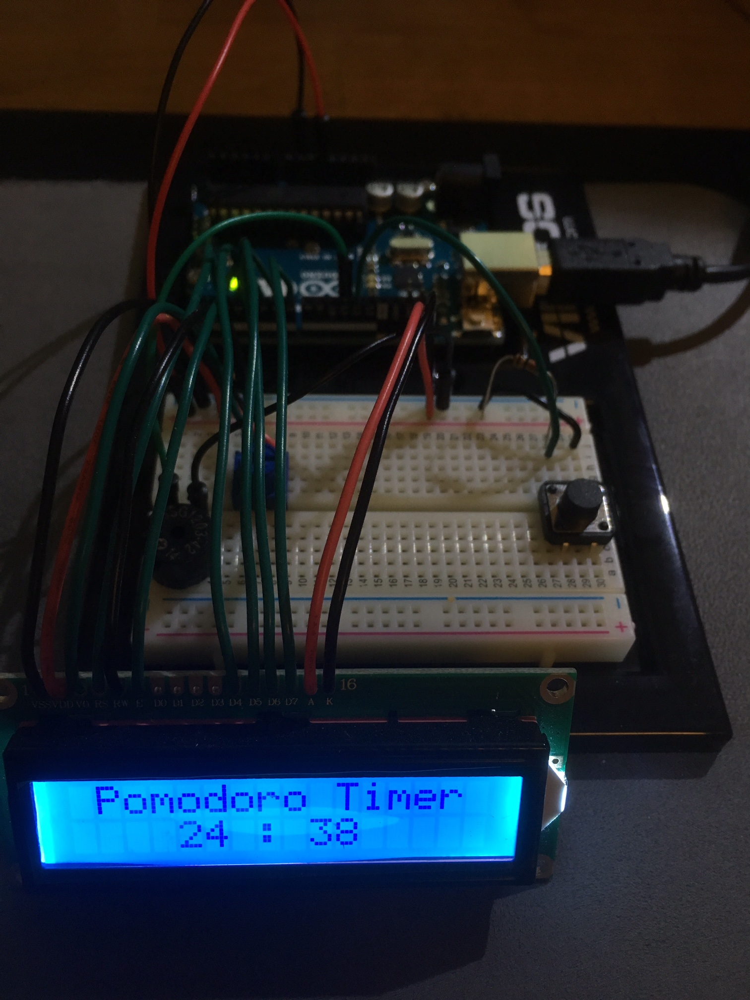
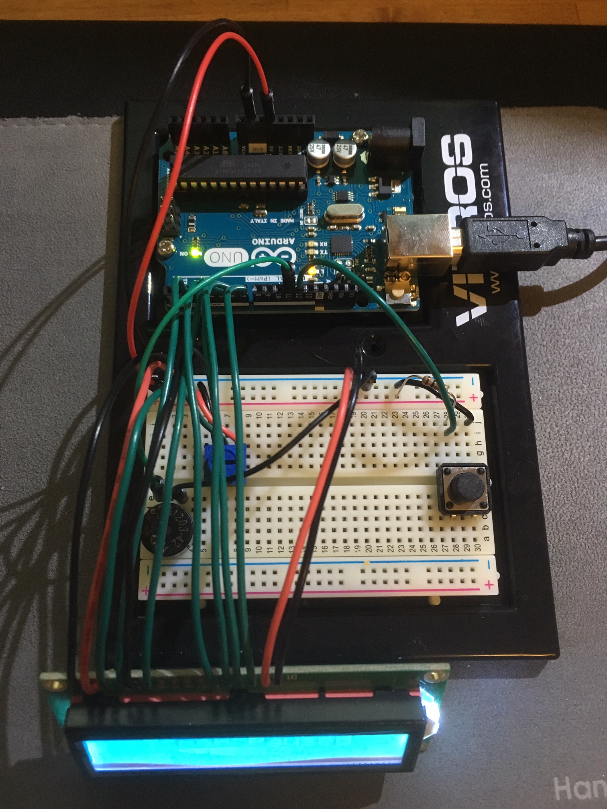

# Arduino Pomodoro Countdown Timer with LCD Display
Need to improve your work flow? Great! maybe this one's for you.

## What's it do?
This arduino project acts as a countdown timer for 25 minute durations, after which a brief alarm will sound. You can see the time counted down on a 16 x 2 LCD Display, the timer can be paused with the press of a tactile push button and reset by pressing the little reset button located on the arduino board.

### Disclaimer:
This is a Frankenstein code compiled of two other sources. All this means aside from the fact that the code is not eye-pleasing is that there's only one issue with this code. The issue doesn't affect the ability for the code to work, it just sits dormant on the file. 

Comprised from Randy Sarafan’s instructable:
http://www.instructables.com/id/Arduino-Countdown-Timer/?ALLSTEPS
and tutorial45’s webpage:
http://tutorial45.com/building-an-arduino-countdown-timer/

#### The issue: 
One of the functions from Randy Sarafan's instructable states that pressing the push button 3 times within one second will reset the timer, it works like a charm on Randy's code, but for some reason it won't register on my rendition. I figured this wasn't too important since I can easily press the actual 'reset' button on the arduino board to get the same result. Aside from that, EVERYTHING ELSE WORKS GREAT!

I had to employ the numerical count down algorithm from tutorial45’s pages and retrofit it to what seemed like the almost incompatible, but totally useful push button functionality of Randy Sarafan’s. Believe me I know it’s not a pretty sight and not the most efficient use of memory space but it does get the job done, dammit!

So if you've made it this far, congrats! You're one in a million, so let's begin.

## What you need
- 1 k resistor [1]
- Push Button [1]
- 10 k Potentiometer [1]
- Standard Piezo Buzzer [1]
- Jumper Wires/22 Gauge Wires
- Arduino Uno Board [1]
- Arduino LiquidCrystal Library
https://www.arduino.cc/en/Reference/LiquidCrystal
- 16 x 2 LCD Display [1]
https://www.amazon.com/uxcell-Standard-Character-Backlight-Display/dp/B00EDMMTGY/ref=as_li_ss_tl?ie=UTF8&qid=1449841759&sr=8-1&keywords=lcd+display&linkCode=sl1&tag=second08c-20&linkId=3f09f6e8500aa21e5704256b471cd150

## Setting it Up
The main details regarding this include the following:
-	Piezo at pin 11
-	Push Button at pin 12
-	LCD connects to pins 2, 3, 4, 5, 6, 7

The rest of the circuit should be able to be recreated from the Fritzing Diagram above.

### Now Load the Arduino Code attached
Open the file 'Pomodoro_Timer_LCD_V5' in your arduino IDE, verify and load to your arduino board and start it up!

## You're finished
You're ready to try out your new Pomodoro Method Timer to improve your workflow when working on multiple tasks. Maybe try and mess with some of the parameters, or find some other applications for this project. Cheers mate!

